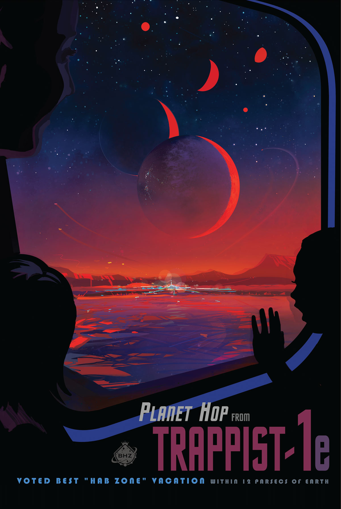

# NASA Poster Converter for BOOX Note Max

A robust script to resize NASA images for Screen Savers or Notebook Covers, optimized for the BOOX Note Max's 13.3" screen.

This script converts high-resolution, portrait-oriented images—like NASA's [Visions of the Future](https://www.jpl.nasa.gov/galleries/visions-of-the-future/) posters—into BOOX-ready 3200×2400 JPEGs optimized for ePaper displays.

**Original Poster**  


**Converted for BOOX Note Max**  


## Why This Script?

The original idea came from [this Reddit post](https://www.reddit.com/r/Onyx_Boox/comments/w9zili/nasa_posters_adapted_for_eink/), which resized NASA posters for older BOOX devices. This script improves upon that with:

- **Linux compatibility** (vs Windows batch)
- **13.3" BOOX Note Max support** (3200×2400 at 300 ppi)
- **Flexible options** for color/grayscale and custom resolutions
- **Better image processing** that preserves details
- **Robust error handling** and user confirmation

## Features

- **Smart grayscale conversion** with detail preservation and Floyd-Steinberg dithering
- **No cropping or distortion** - images fit perfectly with padding
- **Color mode option** for color e-readers
- **Custom resolution support** for any e-ink device
- **Dry-run mode** to preview settings before processing
- **Batch processing** with progress feedback
- **Quality control** with adjustable JPEG compression

## Usage

### Basic Usage
```bash
chmod +x convert_to_booxmax.sh
./convert_to_booxmax.sh
```

### Options
```bash
./convert_to_booxmax.sh [OPTIONS] [WIDTH HEIGHT]

OPTIONS:
    --color, -c     Use color mode (default: grayscale)
    --quality, -q   JPEG quality 1-100 (default: 75)
    --dry-run       Show configuration without processing
    --yes, -y       Skip confirmation prompt
    --help, -h      Show help
```

### Examples

**Default (grayscale for Note Max):**
```bash
./convert_to_booxmax.sh
```

**Color mode:**
```bash
./convert_to_booxmax.sh --color
```

**Custom resolution (Nova Air C 7.8"):**
```bash
./convert_to_booxmax.sh 1404 1872
```

**Tab Ultra (10.3") with color:**
```bash
./convert_to_booxmax.sh --color 1872 1404
```

**Check settings before processing:**
```bash
./convert_to_booxmax.sh --dry-run --color 2400 3200
```

**Batch processing without prompts:**
```bash
./convert_to_booxmax.sh --yes --quality 85
```

## Supported Formats

Input: `.jpg`, `.jpeg`, `.png` (including uppercase)  
Output: High-quality JPEG with `_booxmax.jpg` suffix

## Optional: Upscaling

For older/low-resolution posters, consider upscaling first with [Upscayl](https://github.com/upscayl/upscayl) using 2x-3x Digital Art model if you notice bars or stretching.

## Requirements

- ImageMagick (`magick` command)
- Bash shell
- Image files in current directory